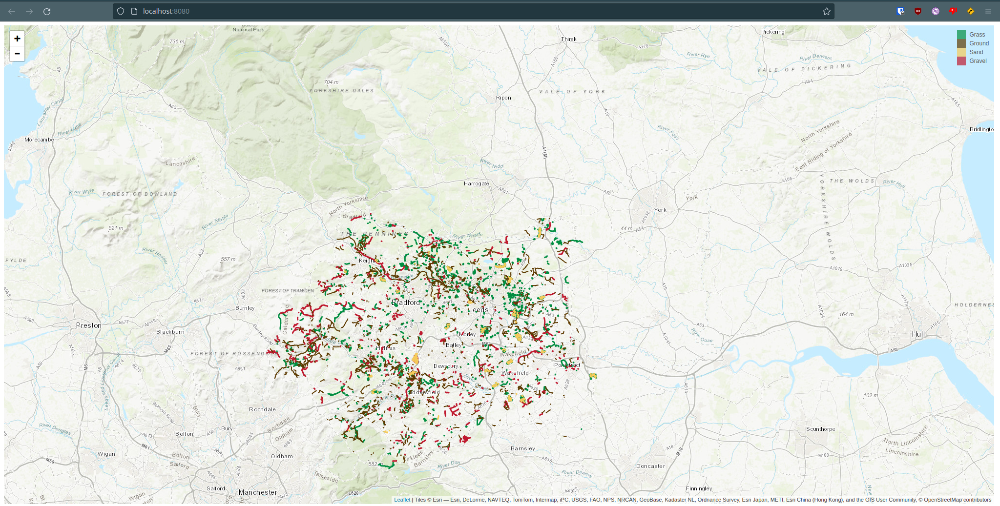

# Surface Map

> render a map of surface types from Open Street Map data

## Usage

1. `make image` to build a Docker image with all the dependencies required
2. `make download` to download and build geojson data from Overpass
3. `make tiles` to turn the geojson data into protobuf tiles
4. `make serve` to serve a map on http://localhost:8080

## Development

The area and types of surface we download are defined at the top of download.py. The current REGION is [West Yorkshire](https://www.openstreetmap.org/relation/88079). Each key in SURFACES becomes a separate geojson file, which becomes a separate vector_layer.

Each layer needs a style adding to `vectorStyles` in public_html/site.js

## Improving Coverage

Open Street Map coverage of surface types isn't great in most places. You can help extend this, and the easiest way of doing so is by using [StreetComplete](https://wiki.openstreetmap.org/wiki/StreetComplete) while out and about. You can make questions about surface types higher priority in the settings.

## License

Copyright © 2022 wheresalice

This work is free. You can redistribute it and/or modify it under the  terms of the Do What The Fuck You Want To Public License, Version 2,  as published by Sam Hocevar. See the COPYING file for more details.
